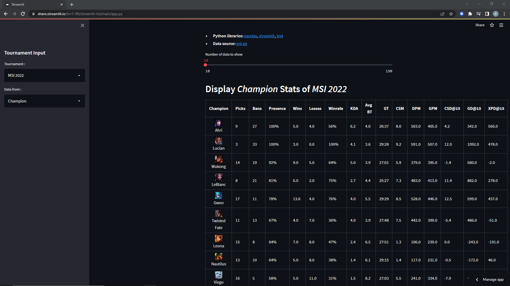

# streamlit
 My first small application with Streamlit. It scrapes the data from a professional League of Legends data website. After that it gives you the options to show evrey tournament available data filtered by players, champions and teams.

Link to the application https://share.streamlit.io/brr1-99/streamlit-lol/main/app.py

